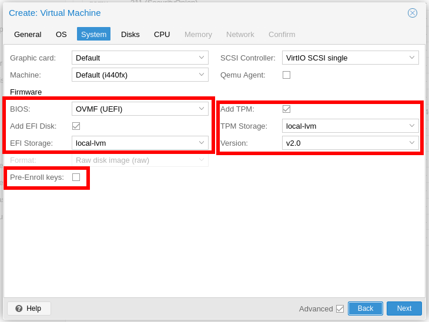

# Encrypted Arch Linux Install (Proxmox)
## Create the Proxmox VM
Create a new Proxmox VM using the Arch Linux ISO. In the System Tab, select "OVMF (UEFI)" as the BIOS type and check the "Add TPM" box. Each of these options will expect a storage location and local-lvm should work for that as long as there is enough space. Other settings can be left with default values or changed depending on your specific needs.  


## Boot from the Arch Linux ISO
### Partition the Disks
Use fdisk -l to list the system's disks. In this case I will be installed Archlinux on /dev/sda. Be sure to replace /dev/sda with the correct disk in all commands in which it appears.
```console
root@archiso ~ # fdisk -l   
Disk /dev/sda: 32 GiB, 34359738368 bytes, 67108864 sectors
Disk model: QEMU HARDDISK   
Units: sectors of 1 * 512 = 512 bytes
Sector size (logical/physical): 512 bytes / 512 bytes
I/O size (minimum/optimal): 512 bytes / 512 bytes


Disk /dev/loop0: 846.72 MiB, 887848960 bytes, 1734080 sectors
Units: sectors of 1 * 512 = 512 bytes
Sector size (logical/physical): 512 bytes / 512 bytes
I/O size (minimum/optimal): 512 bytes / 512 bytes
```

Use fdisk to craeat a disklabel and partition the disk.
- Create a GPT disklabel (required for UEFI)
- Create a new 128Mb partition for EFI (type 1 = EFI)
- Create a new partition for system root
- Change the label of the root partion to 'system'
- Write the new partition table to the disk

```console
root@archiso ~ # fdisk /dev/sda

Welcome to fdisk (util-linux 2.41).
Changes will remain in memory only, until you decide to write them.
Be careful before using the write command.

Device does not contain a recognized partition table.
Created a new DOS (MBR) disklabel with disk identifier 0x690e9d6e.

Command (m for help): g
Created a new GPT disklabel (GUID: AE8AF680-136D-482C-819F-4CF4546120CD).

Command (m for help): n
Partition number (1-128, default 1): 
First sector (2048-67108830, default 2048): 
Last sector, +/-sectors or +/-size{K,M,G,T,P} (2048-67108830, default 67106815): +128M

Created a new partition 1 of type 'Linux filesystem' and of size 128 MiB.

Command (m for help): t
Partition number (1,2, default 2): 1
Partition type or alias (type L to list all): 1

Changed type of partition 'Linux filesystem' to 'EFI System'.

Command (m for help): n
Partition number (2-128, default 2): 
First sector (264192-67108830, default 264192): 
Last sector, +/-sectors or +/-size{K,M,G,T,P} (264192-67108830, default 67106815): 

Created a new partition 2 of type 'Linux filesystem' and of size 31.9 GiB.

Command (m for help): x

Expert command (m for help): n
Partition number (1,2, default 2): 2

New name: system

Partition name changes from '' to 'system'.

Expert command (m for help): r

Command (m for help): w
The partition table has been altered.
Calling ioctl() to re-read partition table.
Syncing disks.
```
### Format the Disk Partitions
The EFI partition needs to be formatted as FAT32. I will then use cryptsetup to encrypt the new root partition (/dev/sda2) with a 512-bit hash. Once that partition is encrypted, I will unlock it with a mapper at /dev/mapper/system and format that as a BTRFS filesystem.
```console
root@archiso ~ # mkfs.vfat -F32 /dev/sda1                     
mkfs.fat 4.2 (2021-01-31)
root@archiso ~ # cryptsetup luksFormat --hash=sha512 --key-slot=3 /dev/sda2

WARNING!
========
This will overwrite data on /dev/sda2 irrevocably.

Are you sure? (Type 'yes' in capital letters): YES
Enter passphrase for /dev/sda2: 
Verify passphrase: 
cryptsetup luksFormat --hash=sha512 --key-slot=3 /dev/sda2  4.95s user 0.19s system 42% cpu 11.971 total
root@archiso ~ # cryptsetup luksOpen /dev/sda2 system
Enter passphrase for /dev/sda2:
root@archiso ~ # mkfs.btrfs /dev/mapper/system
```
Mount the new root partition at /dev/mapper/system to /mnt and create two subvolumes, @ and @home, which can be used in the future for performing backups with snapper and btrfs-snapshots. Then unmount /mnt and remount /dev/mapper/system using the @ subvolume. Create the /mnt/home and /mnt/efi directories and mount the other partitions accordingly.
```console
root@archiso ~ # mount /dev/mapper/system /mnt
root@archiso ~ # cd /mnt
root@archiso ~ # btrfs subvolume create @ @home
root@archiso ~ # cd -
root@archiso ~ # umount /mnt
root@archiso ~ # mount -o subvol=@ /dev/mapper/system /mnt
root@archiso ~ # mkdir /mnt/home
root@archiso ~ # mount -o subvol=@home /dev/mapper/system /mnt/home
root@archiso ~ # mkdir /mnt/efi
root@archiso ~ # mount -o fmask=0077,dmask=0077 /dev/sda1 /mnt/efi
```

```console
root@archiso ~ # pacstrap /mnt base base-devel
...
root@archiso ~ # genfstab -pU /mnt >> /mnt/etc/fstab
root@archiso ~ # arch-chroot /mnt
[root@archiso /]# passwd
New password: 
Retype new password: 
passwd: password updated successfully
[root@archiso /]# pacman -S vim networkmanager btrfs-progs
[root@archiso /]# pacman -S linux linux-firmware
[root@archiso /]# bootctl install
```

/etc/mkinitcpio.conf.d/01-base.conf
```text
HOOKS=(base systemd autodetect microcode modconf keyboard sd-encrypt kms block filesystems fsck)
```

/etc/mkinitcpio.d/linux.preset
```text
# mkinitcpio preset file for the 'linux' package

#ALL_config="/etc/mkinitcpio.conf"
ALL_kver="/boot/vmlinuz-linux"

PRESETS=('default')

#default_config="/etc/mkinitcpio.conf"
default_image="/boot/initramfs-linux.img"
default_uki="/efi/EFI/Linux/arch-linux.efi"
#default_options="--splash /usr/share/systemd/bootctl/splash-arch.bmp"

#fallback_config="/etc/mkinitcpio.conf"
#fallback_image="/boot/initramfs-linux-fallback.img"
#fallback_uki="/efi/EFI/Linux/arch-linux-fallback.efi"
#fallback_options="-S autodetect"
```

/etc/kernel/cmdline
```text
root=/dev/mapper/system rw
rootflags=subvol=@
rootflags=x-systemd.device-timeout=0
```

```console
[root@archiso /]# uuid=$(blkid /dev/sda2 | grep -o ' UUID=[^ ]*' | tr -d ' "')
[root@archiso /]# cat > /etc/crypttab.initramfs <<EOF
system ${uuid} none timeout=0
EOF
```

```console
[root@archiso /]# mkinitcpio -P linux
[root@archiso /]# exit
root@archiso ~ # reboot
```

## Boot into the new Arch Linux Install
Enable and start NetworkManager and check that a network has been established automatically using DHCP.
```console
[root@archlinux ~]# systemctl enable --now NetworkManager
[root@archlinux ~]# nmcli con show
NAME                UUID                                  TYPE      DEVICE 
Wired connection 1  e7da1077-9cb3-3240-adec-ae2b6fd5ba60  ethernet  ens18  
lo                  6257edb0-bcb1-40fc-af90-8aae09bf1520  loopback  lo     
[root@archlinux ~]# nmcli con up "Wired connection 1"
[root@archlinux ~]# ip a
1: lo: <LOOPBACK,UP,LOWER_UP> mtu 65536 qdisc noqueue state UNKNOWN group default qlen 1000
    link/loopback 00:00:00:00:00:00 brd 00:00:00:00:00:00
    inet 127.0.0.1/8 scope host lo
       valid_lft forever preferred_lft forever
    inet6 ::1/128 scope host noprefixroute 
       valid_lft forever preferred_lft forever
2: ens18: <BROADCAST,MULTICAST,UP,LOWER_UP> mtu 1500 qdisc fq_codel state UP group default qlen 1000
    link/ether bc:24:11:96:e2:5e brd ff:ff:ff:ff:ff:ff
    altname enp0s18
    altname enxbc241196e25e
    inet 192.168.50.16/24 brd 192.168.50.255 scope global noprefixroute ens18
       valid_lft forever preferred_lft forever
    inet6 fe80::f539:8513:a70b:fdcf/64 scope link noprefixroute 
       valid_lft forever preferred_lft forever
```

### Enable Secure Boot and Automatic Unlocking on Boot with TPM2
The next few steps implement secureboot by creating keys and registering them with the computer's UEFI firmware with sbctl. Once the keys are generated, sign each of the system's efi files using the -s flag to remeber the files for later signing with sbctl sign-all.  
[Arch Linux Wiki - Assisted process with sbctl](https://wiki.archlinux.org/title/Unified_Extensible_Firmware_Interface/Secure_Boot#Assisted_process_with_sbctl)

**Note:** sbctl will warn that omitting the Microsoft signature might brick the machine. Since I am performing this install in a Proxmox virtual environment, I will ignore this warning and proceed without the Microsoft signatures. On a physical device install it would probably be safer to run sbctl enroll-keys with the --microsoft flag.
```console
root@archiso ~ # pacman -S sbctl
root@archiso ~ # sbctl create-keys
Created Owner UUID XXXXXX
Creating secure boot keys...
Secure book keys created!
[root@archlinux ~]# sbctl enroll-keys
Found OptionROM in the bootchain. This means we should not enroll keys into UEFI without some precautions.

There are three flags that can be used:
    --microsoft: Enroll the Microsoft OEM certificates into the signature database.
    --tpm-eventlog: Enroll OpRom checksums into the signature database (experimental!).
    --yes-this-might-brick-my-machine: Ignore this warning and continue regardless.

Please read the FAQ for more information: https://github.com/Foxboron/sbctl/wiki/FAQ#option-rom
[root@archlinux ~]# sbctl enroll-keys --yes-this-might-brick-my-machine
Enrolling keys to EFI variables...✓ 
Enrolled keys to the EFI variables!
[root@archlinux ~]# find /efi/EFI/ -iname '*.efi'
/efi/EFI/systemd/systemd-bootx64.efi
/efi/EFI/BOOT/BOOTX64.EFI
/efi/EFI/Linux/arch-linux.efi
[root@archlinux ~]# sbctl sign -s /efi/EFI/systemd/systemd-bootx64.efi
[root@archlinux ~]# sbctl sign -s /efi/EFI/BOOT/BOOTX64.EFI
[root@archlinux ~]# sbctl sign -s /efi/EFI/Linux/arch-linux.efi
[root@archlinux ~]# sbctl verify
Verifying file database and EFI images in /efi...
✓ /efi/EFI/BOOT/BOOTX64.EFI is signed
✓ /efi/EFI/Linux/arch-linux.efi is signed
✓ /efi/EFI/systemd/systemd-bootx64.efi is signed
```

After the efi files have been signed, use systemctl-cryptenroll to enroll the TPM2 token to unlock the computer on boot. This allows the computer to boot without a password as long as the disk is not removed from the system and the TPM2 has not tampered with. Then create a recovery-key that can be used to unlock the system in the event that something *does* modify the TPM2. Save this away in a safe place. Once we delete the password originally saved in keyslot 2 this will be the only way to rescue the system if the auto-unlock stops working. Reboot the computer to verify that the auto-unlock works as expected.  
[Arch Linux Wiki - Trusted Platform Module](https://wiki.archlinux.org/title/Systemd-cryptenroll#Trusted_Platform_Module)
```console
[root@archlinux ~]# systemd-cryptenroll --tpm2-device=auto /dev/sda2
🔐 Please enter current passphrase for disk /dev/sda2: ••••••••••              
New TPM2 token enrolled as key slot 0.
[root@archlinux ~]# systemd-cryptenroll --recovery-key /dev/sda2 
A secret recovery key has been generated for this volume:

    🔐 xxxxxxxx-xxxxxxxx-xxxxxxxx-xxxxxxxx-xxxxxxxx-xxxxxxxx-xxxxxxxx-xxxxxxxx

Please save this secret recovery key at a secure location. It may be used to
regain access to the volume if the other configured access credentials have
been lost or forgotten. The recovery key may be entered in place of a password
whenever authentication is requested.
New recovery key enrolled as key slot 1.
[root@archlinux ~]# reboot
```

## That's It!